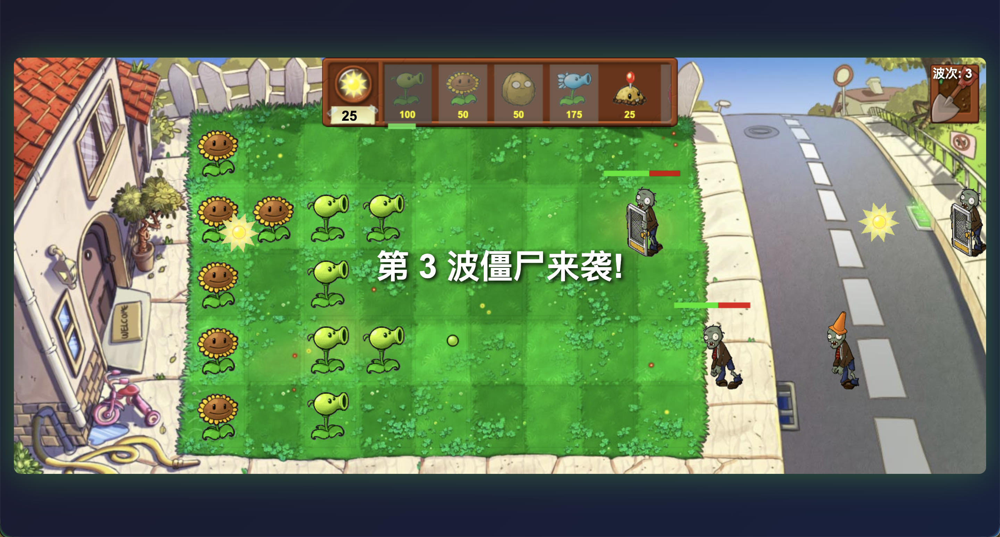

# 植物大战僵尸 (Plants vs Zombies)

基于 **GLM-4.6** + **Claude Code** 实现的经典塔防游戏复刻版

在线体验：[点击前往](https://vinlic.github.io/pvz-game/)



## 项目简介

这是一个使用原生 JavaScript、HTML5 Canvas 和 DOM 技术实现的《植物大战僵尸》网页版复刻游戏。该项目完全由 AI 辅助开发完成，展示了 GLM-4.6 大语言模型与 Claude Code 协同工作的强大能力。

### 技术亮点

- **AI 辅助开发**: 使用 GLM-4.6 + Claude Code 完成全栈开发
- **混合渲染架构**: Canvas 2D 绘制 + DOM 动画层 (GIF)
- **面向对象设计**: 完整的类继承体系
- **响应式交互**: 支持鼠标点击、拖拽、滚轮等操作
- **动态难度系统**: 波次递进式难度增加

## 技术栈

- **前端框架**: 原生 JavaScript (ES6+)
- **渲染引擎**: HTML5 Canvas + DOM 动画层
- **UI 设计**: CSS3 渐变 + 动画效果
- **资源格式**: PNG 静态图片 + GIF 动画 + MP3 音频

## 游戏特性

### 植物种类 (7种)

| 植物 | 阳光消耗 | 特性 |
|------|---------|------|
| 🌻 向日葵 | 50 | 定期生产阳光 |
| 🌱 豌豆射手 | 100 | 发射普通豌豆攻击同一行的僵尸 |
| 🥔 坚果墙 | 50 | 高血量防御植物，可阻挡僵尸 |
| ❄️ 寒冰射手 | 175 | 发射冰冻豌豆，减速僵尸 |
| 💥 土豆雷 | 25 | 需要时间准备，爆炸造成大范围伤害 |
| 🍒 樱桃炸弹 | 150 | 立即爆炸，造成极大范围伤害 |
| 🔄 双发射手 | 200 | 连续发射两颗豌豆 |

### 僵尸种类 (5种)

| 僵尸类型 | 血量 | 速度 | 特殊能力 |
|---------|------|------|---------|
| 普通僵尸 | 180 | 正常 | 无 |
| 路障僵尸 | 560 | 正常 | 路障提供额外防护 |
| 铁桶僵尸 | 1100 | 正常 | 铁桶提供强力防护 |
| 橄榄球僵尸 | 1600 | 2倍快 | 移动速度极快 |
| 玩偶匣僵尸 | 500 | 0.7倍速 | 移动缓慢 |

### 核心机制

1. **阳光系统**
   - 初始阳光: 150
   - 向日葵生产: 每10秒产生25阳光
   - 自然掉落: 每10秒从天空掉落阳光

2. **波次系统**
   - 每50秒增加一波
   - 僵尸生成间隔逐渐缩短
   - 难度递增式提升

3. **卡片系统**
   - 5秒冷却时间
   - 阳光不足时卡片变灰
   - 支持横向滚动查看所有植物

4. **铲子工具**
   - 可移除已种植的植物
   - 支持鼠标悬停预览

## 项目结构

```
glm-cc/
├── index.html          # 游戏主页面
├── game.js             # 游戏核心逻辑 (1700+ 行)
├── images/             # 游戏资源文件夹
│   ├── Background.jpg  # 游戏背景
│   ├── Shop.png        # 植物商店背景
│   ├── Card.png        # 植物卡片背景
│   ├── Shovel.png      # 铲子图标
│   ├── *.gif           # 植物和僵尸动画
│   └── *.png           # 静态图标资源
├── Grazy Dave.mp3      # 背景音乐
└── README.md           # 项目说明文档
```

## 代码架构

### 核心类

- **Game**: 游戏主控制器，管理游戏循环、渲染、事件处理
- **Plant**: 植物基类，处理位置、血量、动画
- **Zombie**: 僵尸基类，处理移动、攻击、状态
- **Pea**: 子弹类，处理飞行、碰撞检测
- **Sun**: 阳光类，处理掉落、收集
- **Explosion**: 爆炸特效类
- **PlantCard**: 植物卡片类，处理选择、冷却
- **SpriteManager**: DOM 精灵管理器，优化 GIF 动画性能
- **AssetLoader**: 资源加载器，异步加载图片和音频

### 技术实现

```javascript
// 混合渲染架构示例
class Plant {
    draw(ctx, spriteManager) {
        if (this.useGif && this.spriteSrc) {
            // 使用 DOM 元素显示 GIF 动画
            spriteManager.createSprite(...);
        } else if (this.sprite) {
            // 使用 Canvas 绘制静态图片
            ctx.drawImage(this.sprite, ...);
        }
    }
}
```

## 安装与运行

### 环境要求

- 现代浏览器 (Chrome/Firefox/Safari/Edge)
- 本地 Web 服务器 (可选，用于加载音频资源)

### 快速开始

1. **克隆项目**

```bash
git clone <repository-url>
cd glm-cc
```

2. **启动本地服务器** (推荐)

由于浏览器安全限制，建议使用本地服务器:

```bash
# Python 3
python -m http.server 8000

# Node.js (使用 npx)
npx serve

# PHP
php -S localhost:8000
```

3. **打开游戏**

访问 `http://localhost:8000`

4. **直接打开** (简单方式)

双击 `index.html` 文件即可运行（音频可能无法播放）

## 操作说明

### 鼠标操作

- **选择植物**: 点击顶部植物卡片
- **种植植物**: 点击草地网格放置植物
- **收集阳光**: 点击掉落的阳光图标
- **使用铲子**: 点击右上角铲子图标，然后点击要移除的植物
- **滚动卡片**: 在卡片区域使用鼠标滚轮或拖拽

### 游戏流程

1. 点击"开始游戏"按钮
2. 消耗阳光种植防御植物
3. 收集自然掉落和向日葵生产的阳光
4. 抵御不断来袭的僵尸波次
5. 僵尸到达左侧房屋则游戏结束

## 开发理念

这个项目展示了现代 AI 辅助开发的强大能力:

- **GLM-4.6**: 提供代码生成、算法设计、问题排查
- **Claude Code**: 提供代码分析、架构优化、文档编写
- **协作模式**: 人类提供创意和方向, AI 负责实现细节

## 性能优化

1. **DOM 精灵池**: 复用 DOM 元素减少内存开销
2. **离屏渲染**: 静态资源预加载
3. **按需更新**: 只更新变化的对象
4. **可视区域裁剪**: 卡片滚动时只渲染可见部分

## 已知问题

- 音频自动播放策略可能被浏览器拦截
- GIF 动画在部分旧浏览器可能性能不佳
- 移动端触摸支持待优化

## 未来计划

- [ ] 添加更多植物和僵尸类型
- [ ] 实现关卡选择系统
- [ ] 添加成就系统
- [ ] 优化移动端体验
- [ ] 多人对战模式
- [ ] 关卡编辑器

## 许可证

本项目仅供学习和研究使用。

## 致谢

- 原游戏《植物大战僵尸》由 PopCap Games 开发
- 游戏素材来源于互联网
- 使用 GLM-4.6 和 Claude Code 辅助开发

---

**开发时间**: 2024年
**AI 模型**: GLM-4.6 + Claude Code
**代码行数**: 1700+ 行
**开发周期**: AI 辅助快速开发

**享受游戏，感受 AI 开发的魅力！**
